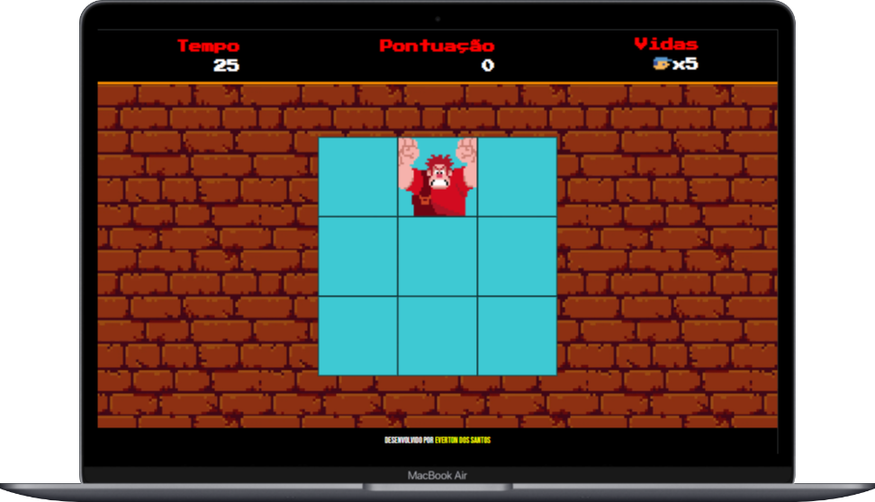
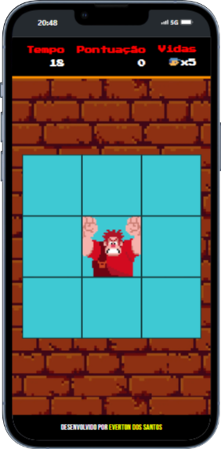

<h1>Jogo Detona Raph</h1>
<a href="https://evertondossantos.github.io/detona_ralph_dio/">Link do jogo.</a>

<h2>Objetivo:</h2>

    O Jogo foi criado com o objetivo de praticar os conteúdos de HTML, CSS e principalmente JavaScript.

<h2>Conteúdo:</h2>

    Nesse jogo ao clicar sobre o Detona Ralph é possível observar o aumento da pontuação e ao errar o click é possivel observar o decremento do número de vidas. Após o fim da contagem de tempo ou o fim das vidas o jogo será finalizado e o placar será exibido.

<h2>Desafios:</h2>

    <ul>
        <li>Criar as funções de modo que o códico seja limpo e de facíl manutenção;</li>
        <li>Tornar o jogo responsivo;</li>
        <li>Aplicar os conteúdos aprendidos e buscar novos conteúdos para melhorias do jogo</li>
    </ul>

    
    

